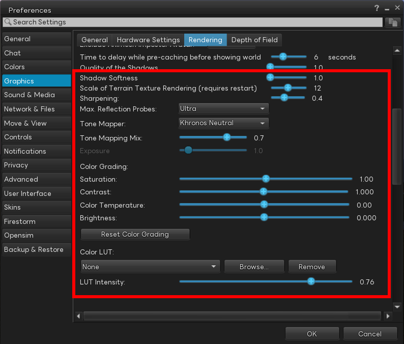
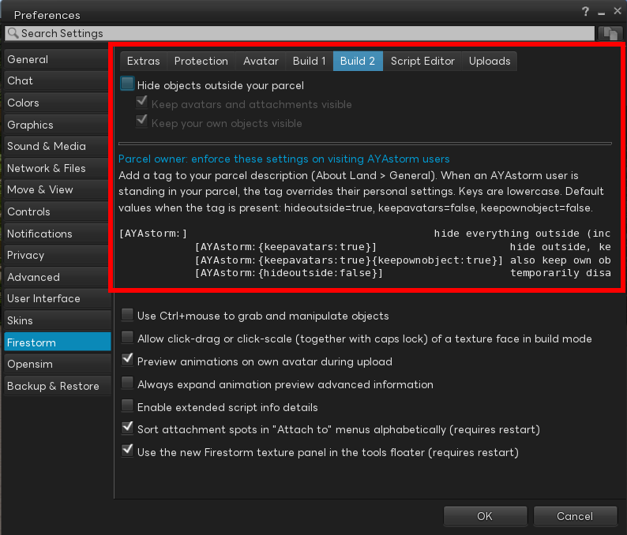
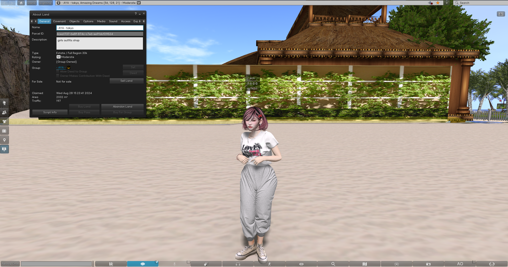
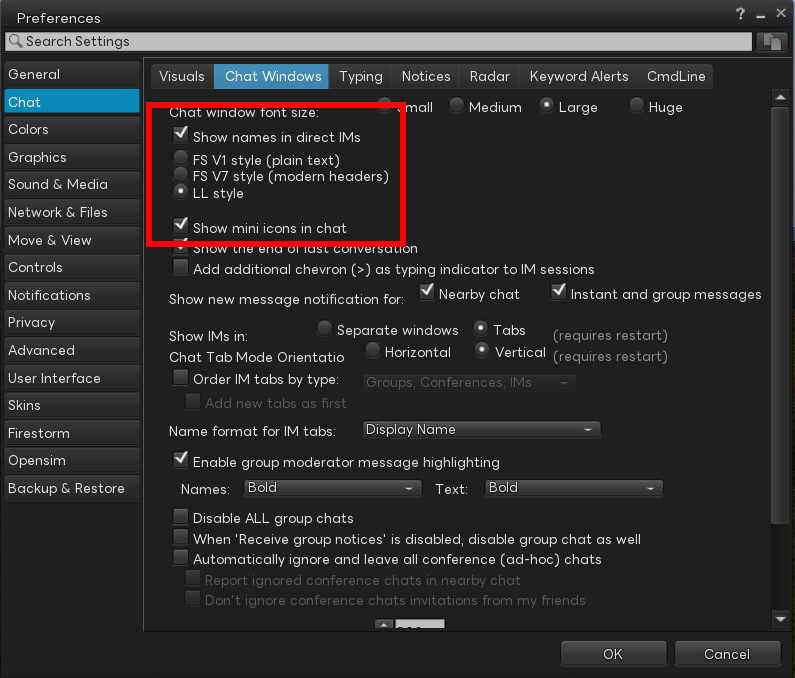

[](https://github.com/mayatonton/phoenix-firestorm/releases/latest)

[English](README.md) | **日本語** | [中文](README.zh.md)


**AYAstorm は [Firestorm](https://www.firestormviewer.org) をベースにした、Second Life 向けカスタム Viewer です。**
レンダリング拡張・UI 改善・日本語対応などを独自に追加しています。

---

## 機能

### レンダリング

環境設定 → グラフィック → レンダリング タブから設定できます。



- **Shadow Softness（影の柔らかさ）** — 影のエッジを柔らかくする調整スライダーを追加

- **トーンマッパー選択肢を拡張** — 既存の Firestorm では内部的に Khronos Neutral 固定だったトーンマッパーを、UI から以下5種類から選択可能に:
  - Khronos Neutral / ACES / Filmic (Uncharted 2) / Uchimura (GT) / Filmic (BD Style)

- **Color Grading コントロール** — Saturation（彩度）／ Contrast（コントラスト）／ Color Temperature（色温度）／ Brightness（明度）の4つを UI から調整可能に。`Reset Color Grading` ボタンで一括リセットできます

- **Color LUT (.cube) 読み込み** — ポストプロセスで `.cube` 形式の 3D LUT を適用してカラーグレーディングが可能。標準で7種のプリセット (`teal_orange` / `warm` / `cold_war` / `sepia` / `cool` / `cinematic` / `film_noir`) を同梱していますが、本来の狙いは **ユーザー自身が任意の `.cube` ファイルを読み込んで描画の風合いを自由に変更できること** です。`Browse...` から好みの LUT を指定し、`LUT Intensity` で適用強度を調整できます

### 区画

環境設定 → Firestorm → Build 2 タブから設定できます。



#### 利用者側 — 区画外オブジェクトを非表示

- **`Hide objects outside your parcel`** — 自分が今立っている区画の外にあるオブジェクトを描画しない設定。**任意の区画で有効**で、撮影時に背景の邪魔なプリムや看板を一時的に消したいとき等に使えます。アバター・添付物・HUD・自分の所有物は除外オプションで残せます (`Keep avatars visible` / `Keep my own objects visible`)

#### 区画オーナー側 — description タグによる強制

区画 (Parcel) の **description (説明文) に下記タグを書き込む**だけで、その区画を訪れた **AYAstorm 利用者** に対して上記の隠し動作を強制発動できます。**他の Viewer (本家 Firestorm / 公式 LL Viewer 等) はこのタグを解釈しないため影響を受けません** — つまり「AYAstorm ユーザーにだけ効くプライバシー保護タグ」として機能します。区画オーナー権限で書ける箇所なので、訪問者側の合意も設定変更も不要です。

**タグ書式:**

```
[parcelhide:{key:value}{key:value}...]
```

- description のどこに書いても OK (前後に他の文章があっても可)
- 旧形式 `[AYAstorm:...]` も互換受付 (r5 で `[parcelhide:...]` にリネーム)

| キー | デフォルト | 動作 |
|---|---|---|
| `hideoutside` | `true` | `false` でタグを一時無効化 |
| `keepavatars` | `false` | `true` でアバター・HUD は表示 |
| `keepownobject` | `false` | `true` で訪問者自身の所有物は表示 |
| `altitude` | (なし) | `min-max[,min-max...]` 形式で自分の高度 Z が指定範囲のいずれかに入っているときだけ発火 (両端 inclusive、ハイフン区切り、複数範囲はカンマ区切り)。撮影用 skybox 階だけ非表示にしたい等の用途 |

**例:**

| description に書く文字列 | 効果 |
|---|---|
| `[parcelhide:]` | 区画外を全部隠す (アバターも自分の物も隠す) |
| `[parcelhide:{keepavatars:true}]` | アバターは見えるが他の物は隠す |
| `[parcelhide:{keepavatars:true}{keepownobject:true}]` | 一般的に使いやすい設定 |
| `[parcelhide:{hideoutside:false}]` | タグ一時無効 (イベント時など) |
| `[parcelhide:{altitude:1000-2000,3000-4000}]` | 高度 1000-2000m か 3000-4000m に居るときだけ非表示発火 (skybox 階だけ隠す等) |

**効果イメージ:**

<table>
<tr>
<td width="50%" align="center"><b>タグなし</b><br/>(通常表示)</td>
<td width="50%" align="center"><b>タグあり</b><br/>(<code>[parcelhide:...]</code> in description)</td>
</tr>
<tr>
<td></td>
<td></td>
</tr>
</table>

### オーディオ

#### 3D Stream — プリムから音源を 3D 定位再生

HTTP オーディオストリーム (SHOUTcast / Icecast / 静的 MP3 / Vorbis / Opus / FLAC) を **プリム位置から 3D 定位再生** する機能です。SL 標準の「パーセル単位 BGM の 2D 再生」と違い、リスナーが動くと音の方向と距離感が実時間で追従します。**ライブ会場の PA / 環境音 / マルチスピーカー会場 / 5.1ch 会場展開** などに使えます。プリムの **Description (説明文) フィールドにタグを書くだけ** で完結し、LSL スクリプトは不要です。

**最小例:**

```
[3dstream:{url:http://example.com/stream.mp3}]
```

タグを書いたプリムから 3D 定位でストリームが鳴ります。

**ステレオ / 5.1ch / マルチスピーカー対応:**

リンクセット内の各プリムに `[3dstream-stereo:{ch:L|R|M|FL|FR|C|LFE|SL|SR}]` を割り当てて、L/R を別プリムに分けたり 5.1ch ソースを 6 プリムに展開できます。詳細・全キー・互換マトリクス・配信側レシピ・トラブルシューティングは下記の言語別ガイドをご覧ください。

**詳細ガイド:**

- 🇯🇵 [3D Stream タグ書式ガイド (日本語)](docs/guides/3dstream-tag-guide.ja.md)
- 🇬🇧 [3D Stream Tag Format Guide (English)](docs/guides/3dstream-tag-guide.en.md)
- 🇨🇳 [3D Stream 标签格式指南 (简体中文)](docs/guides/3dstream-tag-guide.zh.md)

### チャット UI

環境設定 → チャット → Chat Windows タブから設定できます。



- **LL スタイルのチャットウィンドウを移植** — Firestorm の Nearby Chat は元々 `FS V1 (plain text)` と `FS V7 (modern headers)` から選択でき機能的にも優秀ですが、**チャットレンジ内のユーザーを把握するには別ウィンドウを開く必要がありました**。AYAstorm では **Linden Lab 公式 Viewer の CONVERSATIONS ウィンドウの見た目をそのまま移植した `LL style` を新規追加**し、チャットウィンドウを開いているだけで **チャットレンジ内のユーザーをそのまま一覧確認できる** ようにしました

- **発言者プロフィールアイコン表示 (`Show mini icons in chat`)** — チャット発言行のユーザー名の隣にプロフィールアイコンを表示。名前文字列だけでは発言者の判別がしづらかったため、アイコンを併置することで **誰の発言か直感的にわかる** ようにしています

  

- **チャットレンジ参加者フィルタ** — ローカルチャット参加者リストをチャットレンジ (20m) 以内のみ表示

### 日本語対応

- **Linux + Mozc + Fcitx5 の IME 候補ウィンドウ位置バグを修正** — 既存の Firestorm では Linux 上で Mozc + Fcitx5 を使うと **変換候補ウィンドウが画面左下に飛んでしまい実質使い物にならない** 致命的な問題がありました。AYAstorm ではこのバグを修正し、入力中のキャレット位置のすぐ下に変換候補が正しく表示されるようにしています。Linux で日本語入力する人にとって特に重要な修正です

- **日本語フォントを4ファミリー同梱** — 追加インストール不要で日本語が正しく表示されます。好みに応じて環境設定の Chat フォント等から切り替え可能:
  - **Noto Sans JP** — Google Noto プロジェクトの日本語サンセリフ。クセのない万能型で標準のおすすめ
  - **IBM Plex Sans JP** — IBM の OSS 企業フォント。やや幾何学的でモダンな見た目
  - **Alibaba Sans JP** — Alibaba がオープンソース公開したサンセリフ。柔らかく親しみのある書体
  - **LINE Seed JP** — LINE 社の OSS フォント。ややキャラクターのある今風のデザイン

- **OTF フォントサポート修正** — OTF 形式のフォント (上記の Alibaba / IBM Plex / LINE Seed JP は OTF) が正しく読み込まれるよう修正

---

## ダウンロード

最新版のビルド済みバイナリは **[GitHub Releases](https://github.com/mayatonton/phoenix-firestorm/releases/latest)** からダウンロードできます。

| OS | ファイル | 使い方 |
|----|------|------|
| Windows (x64) | `Phoenix-FirestormOS-AYAstorm-release_AVX2-*_Setup.exe` | NSIS インストーラー。ダウンロードして実行 |
| Linux (x64) | `Phoenix-FirestormOS-AYAstorm-release_LEGACY-*.tar.xz` | 任意の場所に展開し、中の `install.sh` を実行 |
| macOS | （準備中） | — |

> **※ AVX2 非対応の古い CPU の場合 (Windows のみ)**: 上記 AVX2 版を実行するとインストール開始前にその旨のメッセージが出ます。代わりに `Phoenix-FirestormOS-AYAstorm-release_LEGACY-*_Setup.exe` をダウンロードしてご利用ください。AVX2 は概ね 2013年以降の Intel / AMD CPU で対応しているため、ほとんどの方は AVX2 版で問題ありません。

**Linux インストール例:**

```bash
tar xf Phoenix-FirestormOS-AYAstorm-release_LEGACY-*.tar.xz
cd Phoenix-FirestormOS-AYAstorm-release_LEGACY-*/
./install.sh
~/ayastorm/ayastorm
```

---

## ビルド方法

AYAstorm 独自のビルド手順 (Linux / Windows):

- [AYAstorm ビルド手順書](docs/build/building_ayastorm.md)

本家 Firestorm のビルド手順 (Mac はこちらを参照):

- [Windows](doc/building_windows.md)
- [Mac](doc/building_macos.md)
- [Linux](doc/building_linux.md)

---

## 貢献者

### AYAstorm チーム

<table>
  <tr>
    <td align="center">
      <a href="https://github.com/mayatonton">
        
        <br/>
        <sub><b>mayatonton</b></sub>
      </a>
      <br/>
      <sub>作者 / メンテナ</sub>
    </td>
    <td align="center">
      <a href="https://github.com/t-noami">
        
        <br/>
        <sub><b>t-noami</b></sub>
      </a>
      <br/>
      <sub>共同メンテナ</sub>
    </td>
    <!--
    To add another contributor, copy a <td> block above and update:
      - the GitHub username in the URL and image src
      - the display name in <sub><b>...</b></sub>
      - the role text in the trailing <sub>...</sub>
    -->
  </tr>
</table>

AYAstorm の開発に参加しませんか? バグ報告、Pull Request、翻訳すべて歓迎です — [CONTRIBUTING.md](CONTRIBUTING.md) を参照してください。

### Firestorm をベースに

AYAstorm は [Phoenix Firestorm](https://www.firestormviewer.org) のフォークで、Firestorm は [Second Life](https://github.com/secondlife/viewer) の公式クライアントから派生した LGPL ライセンスのオープンソース Viewer です。

AYAstorm の土台となっている Firestorm チームと上流の全コントリビューターに心からの感謝を:

<a href="https://github.com/FirestormViewer/phoenix-firestorm/graphs/contributors">
  
</a>
