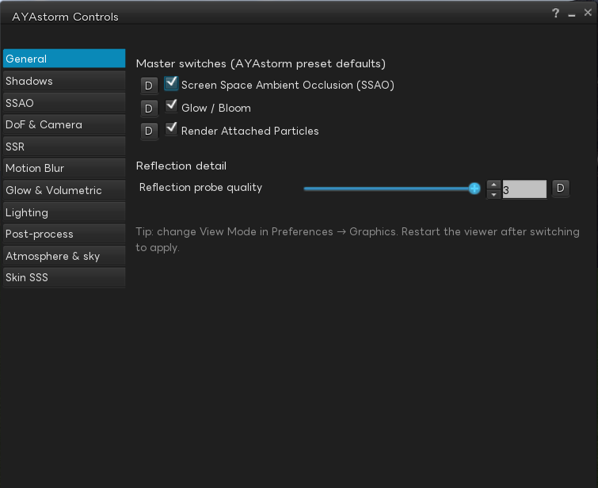

[](https://github.com/mayatonton/phoenix-firestorm/releases/latest)

[English](README.md) | [日本語](README.ja.md) | **中文**


**AYAstorm 是基于 [Firestorm](https://www.firestormviewer.org) 的定制 Second Life 客户端。**
在渲染增强、界面改进和日语支持方面有独特改进。

---

## 功能

### AYAstorm Controls

从 **AYAstorm** 菜单(位于 Build 与 Help 之间)→ `AYAstorm Controls...` 打开,或按 `Alt+C`。



将 AYAstorm 的预设主开关与 11 个渲染分类按左侧标签栏集中在单一 floater。每项控件旁的 `D` 按钮可一键恢复到 AYAstorm preset 默认值,无需翻 debug settings 即可进行 live A/B 调整。

- **General** — SSAO / Glow & Bloom / Render Attached Particles 的主开关,以及 Reflection probe quality 滑块。在进入各效果细调前,作为顶层 ON/OFF 面板使用

- **Shadows** — Shadow Detail 级别(关闭 / 仅太阳 / 太阳 + spot + projector)、自动 vs. 手动 cascade 距离、shadow blur size、分辨率缩放、shadow far clip。可在柔和度与阴影绘制距离之间取得平衡

- **SSAO** — SSAO 主开关(与 General 标签联动)、`Blur deferred lights` 开关、AO 调整滑块。调整接触阴影强度与衰减

- **DoF & Camera** — Depth of Field 主开关、**High-quality DoF(4× CoF,depth-gated)**、前景虚化(front-of-focus blur)、是否将 alpha 透明面纳入 DoF depth,以及 camera 侧 AYAstorm preset 数值(focal length / aperture 等)和 DoF 联动的 chromatic aberration 强度

- **SSR** — Screen Space Reflections 主开关与 6 条 quality tuning 滑块(step count、max distance 等)。在 deferred opaque buffer 之上叠加湿地板 / 玻璃反射

- **Motion Blur** — Motion Blur 主开关、`Blur self avatar` / `Blur other avatars` 独立开关,以及 Antialiasing 子节

- **Glow & Volumetric** — Glow / Bloom 强度调整、**Volumetric Lighting(AYA godrays)**(带太阳低于地平线时的 directional fade),以及独立的 **Godrays(sun-facing beam)**(沿太阳光轴的更强光束变体)

- **Lighting** — Enable fullbright textures(global)/ in-world 的 point/spot 光 / 自己的 attached 光 / 他人的 attached 光 —— 决定 local-light pipeline 对场景贡献量的 4 个开关

- **Post-process** — Contrast Adaptive Sharpening(CAS)与 Post FX 滑块,作为 framebuffer 上的最终 post-process pass

- **Atmosphere & sky** — Sky depth & sun glare、distant blue haze、morning blue / evening warm tint —— 叠加在 EEP 之上的 AYAstorm View 标志性大气表现

- **Skin SSS** — 肌肤半透明 subsurface scattering: 主开关、blur radius / strength 等参数,以及 target mesh UUID 白名单与 `Lock editing(prevent accidental changes)` / `Reset all to defaults`

> 提示:**View Mode**(Firestorm / AYAstorm View)的切换位于 设置 → 图形。切换后需重启 viewer 才能生效。

### 渲染

可在 设置 → 图形 → 渲染 标签页中配置。


- **阴影柔和度** — 新增滑块用于柔化阴影边缘

- **可选色调映射器** — 上游 Firestorm 在内部固定为 Khronos Neutral，AYAstorm 在界面上提供五种选择：
  - Khronos Neutral / ACES / Filmic (Uncharted 2) / Uchimura (GT) / Filmic (BD Style)

- **色彩分级控制** — 在界面上添加了饱和度 / 对比度 / 色温 / 亮度四项滑块，并提供 `Reset Color Grading` 一键重置按钮

- **Color LUT (.cube) 加载** — 通过后处理应用 `.cube` 格式的 3D LUT 进行色彩分级。内置七种预设 (`teal_orange` / `warm` / `cold_war` / `sepia` / `cool` / `cinematic` / `film_noir`)，但核心目的是 **让用户加载自己的 `.cube` 文件，自由定制画面风格**。通过 `Browse...` 选择 LUT，并使用 `LUT Intensity` 调整应用强度

### 区域

可在 设置 → Firestorm → Build 2 标签页中配置。


#### 用户侧 — 隐藏区域外物体

- **`Hide objects outside your parcel`** — 不渲染当前所站区域之外的物体。**在任意区域均可启用** —— 拍摄截图时想清理掉相邻地块上碍眼的物件或招牌时非常有用。可通过 `Keep avatars visible` / `Keep my own objects visible` 保留头像 / 附件 / HUD / 自有物体

#### 区域所有者侧 — 通过描述标签强制启用

只需在 **区域 (Parcel) 的描述文本中** 写入下方标签，所有访问该区域的 **AYAstorm 用户** 都会被强制启用上述隐藏行为。**其他 Viewer (上游 Firestorm / 官方 LL Viewer 等) 不会解析此标签，因此完全不受影响** —— 也就是说，它是一个 "仅对 AYAstorm 用户生效的隐私保护标签"。区域所有者无需访问者配合即可设置。

**标签格式:**

```
[parcelhide:{key:value}{key:value}...]
```

- 可写在描述的任何位置（前后可有其他文本）
- 旧式 `[AYAstorm:...]` 格式仍可向后兼容 (r5 中重命名为 `[parcelhide:...]`)

| 键 | 默认 | 行为 |
|---|---|---|
| `hideoutside` | `true` | `false` 临时禁用此标签 |
| `keepavatars` | `false` | `true` 保留头像与 HUD |
| `keepownobject` | `false` | `true` 保留访问者自有物体 |
| `altitude` | (无) | `min-max[,min-max...]` 格式，仅当自身高度 Z 落入任一指定范围时触发 (两端 inclusive，连字符分隔，多范围以逗号分隔)。例如只对特定 skybox 楼层启用隐藏 (摄影用途) |

**示例:**

| 写入描述的字符串 | 效果 |
|---|---|
| `[parcelhide:]` | 隐藏区域外的所有内容 (包括头像和自有物体) |
| `[parcelhide:{keepavatars:true}]` | 保留头像，其他物体隐藏 |
| `[parcelhide:{keepavatars:true}{keepownobject:true}]` | 通用推荐设置 |
| `[parcelhide:{hideoutside:false}]` | 临时禁用 (例如举办活动时) |
| `[parcelhide:{altitude:1000-2000,3000-4000}]` | 仅当处于 1000-2000m 或 3000-4000m 高度时启用隐藏 (例如特定 skybox 楼层) |

**效果对比:**

<table>
<tr>
<td width="50%" align="center"><b>无标签</b><br/>(普通渲染)</td>
<td width="50%" align="center"><b>有标签</b><br/>(<code>[parcelhide:...]</code> in description)</td>
</tr>
<tr>
<td></td>
<td></td>
</tr>
</table>

### 音频

#### 3D Stream — 从图元 3D 定位播放音频流

将 HTTP 音频流 (SHOUTcast / Icecast / 静态 MP3 / Vorbis / Opus / FLAC) **以 3D 定位的方式从图元位置播放**。与 SL 标准的"地块级 2D BGM"不同，听者移动时声音的方向感和距离感会实时跟随。**适用于现场演出 PA / 环境音 / 多扬声器会场 / 5.1ch 会场展开** 等用途。仅在图元的 **Description (说明文字) 字段里写标签** 即可完成配置，无需 LSL 脚本。

**最简示例:**

```
[3dstream:{url:http://example.com/stream.mp3}]
```

写有此标签的图元会以 3D 定位播放该音频流。

**立体声 / 5.1ch / 多扬声器支持:**

为链接组中的各图元分配 `[3dstream-stereo:{ch:L|R|M|FL|FR|C|LFE|SL|SR}]`，可以把 L/R 拆到不同图元，或将 5.1ch 源展开到 6 个图元。完整参考 (全部键、兼容矩阵、推流端配方、故障排查) 请见下方各语言版指南。

**完整参考:**

- 🇯🇵 [3D Stream タグ書式ガイド (日本語)](docs/guides/3dstream-tag-guide.ja.md)
- 🇬🇧 [3D Stream Tag Format Guide (English)](docs/guides/3dstream-tag-guide.en.md)
- 🇨🇳 [3D Stream 标签格式指南 (简体中文)](docs/guides/3dstream-tag-guide.zh.md)

### 聊天界面

可在 设置 → 聊天 → Chat Windows 标签页中配置。


- **移植 LL 风格聊天窗口** — Firestorm 原有的 Nearby Chat 提供 `FS V1 (纯文本)` 和 `FS V7 (现代头部)` 两种风格，功能强大，但 **要查看聊天范围内的用户必须打开另一个窗口**。AYAstorm 新增 **`LL style`**，将 Linden Lab 官方客户端 CONVERSATIONS 窗口的外观直接移植过来，**只需打开聊天窗口即可一览聊天范围内的用户**

- **发言者头像图标 (`Show mini icons in chat`)** — 在聊天行的用户名旁显示头像图标——仅靠名字文本难以快速识别发言者，附上头像后 **一眼就能看出是谁在说话**

  

- **聊天范围参与者过滤** — 仅在附近聊天列表中显示聊天范围（20米）内的用户

### 日语支持

- **修复 Linux + Mozc + Fcitx5 输入法候选窗口位置错误** — 上游 Firestorm 在 Linux 上使用 Mozc + Fcitx5 时存在严重 bug——**候选窗口会跳到屏幕左下角，导致输入实际上无法使用**。AYAstorm 修复了此问题，候选窗口现可正确显示在光标正下方。对在 Linux 上使用日语输入的用户尤为重要

- **内置四款日语字体家族** — 开箱即用，无需额外安装。可在偏好设置中切换：
  - **Noto Sans JP** — Google Noto 项目的日语无衬线字体，中性百搭，推荐默认使用
  - **IBM Plex Sans JP** — IBM 开源的企业字体，略带几何感，现代风格
  - **Alibaba Sans JP** — 阿里巴巴开源的无衬线字体，柔和友好
  - **LINE Seed JP** — LINE 公司开源的字体，带有现代设计个性

- **OTF字体支持修正** — 修复了 OTF 格式字体的加载问题（上述 Alibaba / IBM Plex / LINE Seed JP 均为 OTF）

---

## 文档

### 用户使用指南

- **Skin SSS — Avatar 摄影**: [🇺🇸 en](docs/specs/skin-sss-user-guide.md) · [🇯🇵 ja](docs/specs/skin-sss-user-guide.ja.md) · [🇨🇳 zh](docs/specs/skin-sss-user-guide.zh.md)
- **3D Stream 标签格式**: [🇺🇸 en](docs/guides/3dstream-tag-guide.en.md) · [🇯🇵 ja](docs/guides/3dstream-tag-guide.ja.md) · [🇨🇳 zh](docs/guides/3dstream-tag-guide.zh.md)

### 公开技术规范 (面向其他 SL Viewer 开发者)

将 SL Viewer 全体共通存在的 bug 与 AYAstorm 采用的修复方案以公开规范形式公开，便于 LL 派生 viewer fork 无需 PR 自由取入。

- **Rigged Mesh Picker — GPU object-ID buffer**: [🇺🇸 en](docs/specs/rigged-mesh-picker-gpu-buffer.md) · [🇯🇵 ja](docs/specs/rigged-mesh-picker-gpu-buffer.ja.md) · [🇨🇳 zh](docs/specs/rigged-mesh-picker-gpu-buffer.zh.md)
- **Double Alpha Block — forward alpha BLEND 修复** (公开专用分支): [🇺🇸 en](https://github.com/mayatonton/phoenix-firestorm/blob/fix/double-alpha-block/docs/specs/double-alpha-block-fix.md) · [🇯🇵 ja](https://github.com/mayatonton/phoenix-firestorm/blob/fix/double-alpha-block/docs/specs/double-alpha-block-fix.ja.md) · [🇨🇳 zh](https://github.com/mayatonton/phoenix-firestorm/blob/fix/double-alpha-block/docs/specs/double-alpha-block-fix.zh.md)

---

## 下载

最新编译版可在 **[GitHub Releases](https://github.com/mayatonton/phoenix-firestorm/releases/latest)** 下载。

| OS | 文件 | 使用方法 |
|----|------|------|
| Windows (x64) | `Phoenix-FirestormOS-AYAstorm-release_AVX2-*_Setup.exe` | NSIS 安装程序，下载后运行 |
| Linux (x64) | `Phoenix-FirestormOS-AYAstorm-release_LEGACY-*.tar.xz` | 解压到任意位置，运行其中的 `install.sh` |
| macOS | （即将推出） | — |

> **若 CPU 不支持 AVX2 (仅 Windows)**: 运行上述 AVX2 版本时，安装程序会在安装开始前提示该问题。请改为下载 `Phoenix-FirestormOS-AYAstorm-release_LEGACY-*_Setup.exe`。AVX2 在 2013 年之后的 Intel / AMD CPU 上基本均支持，因此大多数用户使用 AVX2 版本即可。

**Linux 安装示例:**

```bash
tar xf Phoenix-FirestormOS-AYAstorm-release_LEGACY-*.tar.xz
cd Phoenix-FirestormOS-AYAstorm-release_LEGACY-*/
./install.sh
~/ayastorm/ayastorm
```

---

## 编译说明

AYAstorm 专用编译步骤 (Linux / Windows):

- [AYAstorm 编译指南](docs/build/building_ayastorm.md)

上游 Firestorm 编译指南 (Mac 请参考此处):

- [Windows](doc/building_windows.md)
- [Mac](doc/building_macos.md)
- [Linux](doc/building_linux.md)

---

## 贡献者

### AYAstorm 团队

<table>
  <tr>
    <td align="center">
      <a href="https://github.com/mayatonton">
        
        <br/>
        <sub><b>mayatonton</b></sub>
      </a>
      <br/>
      <sub>创建者 / 维护者</sub>
    </td>
    <td align="center">
      <a href="https://github.com/t-noami">
        
        <br/>
        <sub><b>t-noami</b></sub>
      </a>
      <br/>
      <sub>共同维护者</sub>
    </td>
    <!--
    To add another contributor, copy a <td> block above and update:
      - the GitHub username in the URL and image src
      - the display name in <sub><b>...</b></sub>
      - the role text in the trailing <sub>...</sub>
    -->
  </tr>
</table>

想要参与 AYAstorm 的开发吗？欢迎提交 Bug 报告、Pull Request 和翻译 — 详见 [CONTRIBUTING.md](CONTRIBUTING.md)。

### 基于 Firestorm

AYAstorm 是 [Phoenix Firestorm](https://www.firestormviewer.org) 的分支项目，而 Firestorm 本身是基于 [Second Life](https://github.com/secondlife/viewer) 官方客户端的开源项目，采用 LGPL 许可证。

衷心感谢 Firestorm 团队以及所有上游贡献者，他们的工作正是 AYAstorm 得以构建的基础：

<a href="https://github.com/FirestormViewer/phoenix-firestorm/graphs/contributors">
  
</a>
