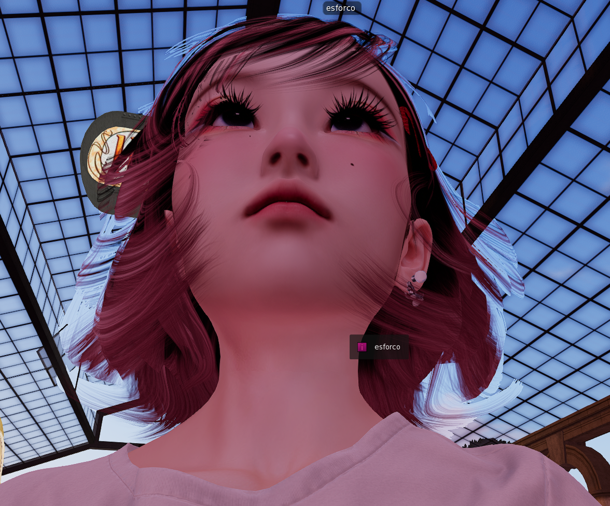
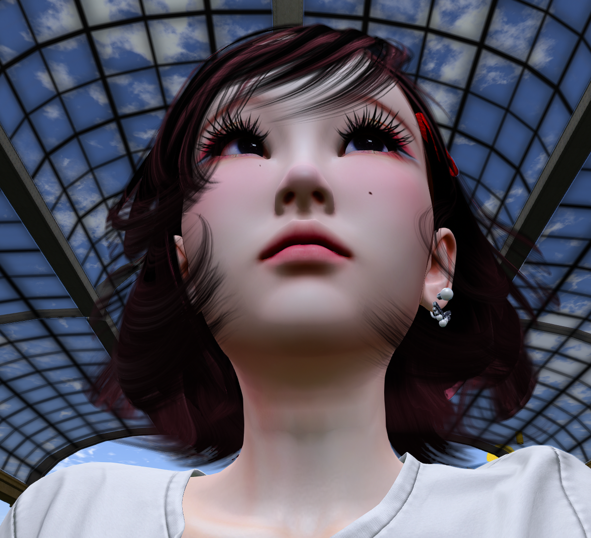
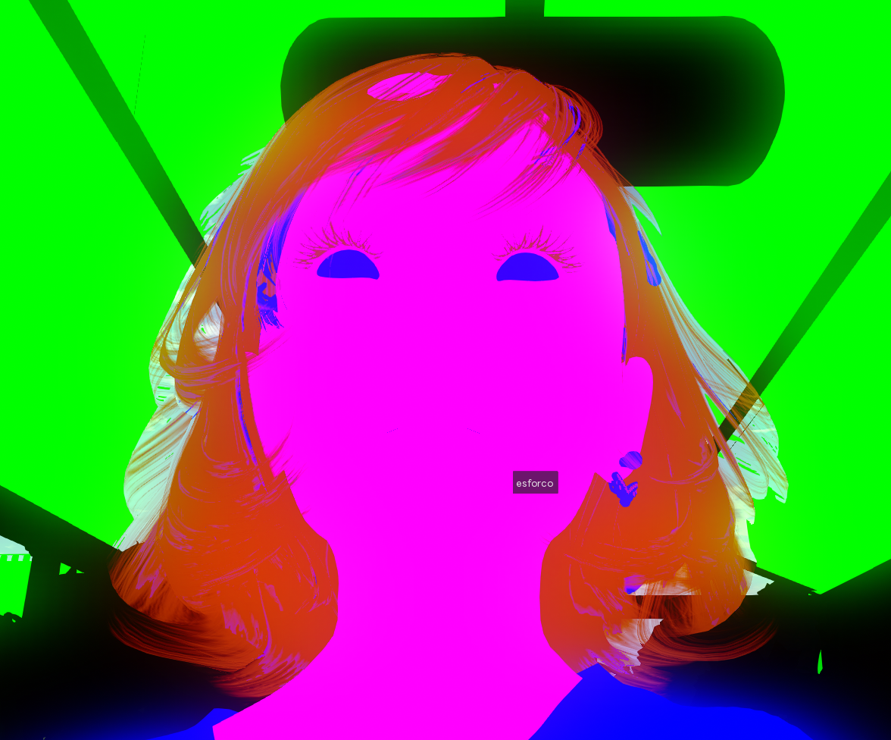
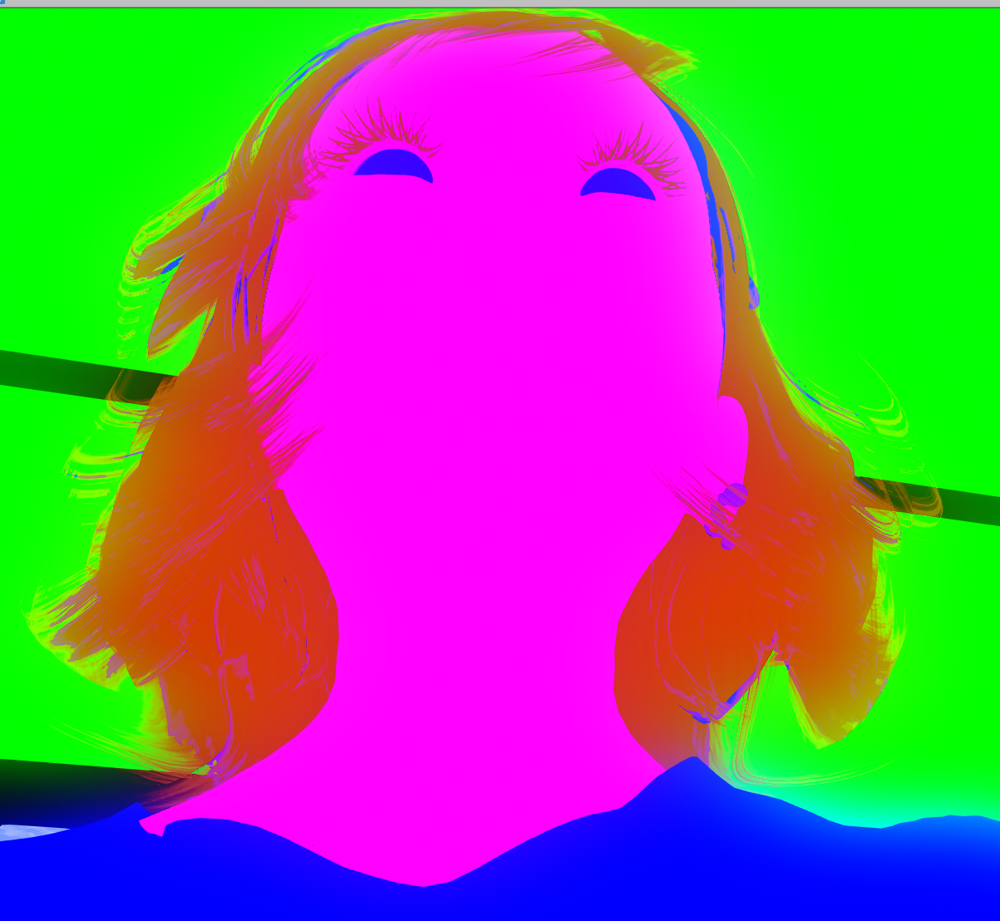

> **Language / 言語 / 语言**: [English](./double-alpha-block-fix.md) · [日本語](./double-alpha-block-fix.ja.md) · **中文**

# 双重 alpha 屏蔽 (Double Alpha Block) — 所有 SL viewer 共通的渲染 bug 与两行修复

**状态**: 已在 AYAstorm 中修复。欢迎所有 LL viewer 派生 fork 自由取用 — 不需要 PR，按需取走。

**参考分支**: `mayatonton/phoenix-firestorm` 的 [`fix/double-alpha-block`](https://github.com/mayatonton/phoenix-firestorm/tree/fix/double-alpha-block)。HEAD 跟随本文档的最新修订版本，但 §5 修复本体自初次 commit 起未变。**验证快照** (§8 用 canary 状态) 永久固定于 commit `2597b657ac` — `git checkout 2597b657ac` 可复现彩色验证帧。

**详细追踪**: [`docs/specs/ayastorm-rez-object-rendering-routing.md`](./ayastorm-rez-object-rendering-routing.md) §11 含完整 canary 验证与 dispatcher 路由图

---

## 1. TL;DR

在 post-water alpha pool 中绘制 forward alpha BLEND 时，**rigged 挂件 (头发、衣物) 先绘制并将 z 写入共享 depth buffer**。其后方的 non-rigged alpha BLEND 物体 (玻璃窗、蕾丝、树叶) **会在 fragment shader 运行之前被 depth reject**，最终像素回退为 opaque pass 写入的天空。

修复方法是在 `LLDrawPoolAlpha::renderPostDeferred` 中交换两个 forward pass 的顺序，使 non-rigged 先 (后景) → rigged 后 (前景)。**仅限 `POOL_ALPHA_POST_WATER`**。PRE_WATER 和 HUD 不动。

实质两行差异。无需新增 uniform、新增 render target、也无需修改 shader。

## 2. 受影响的 viewer

此 bug **并非 AYAstorm 独有**。问题代码 — `write_depth = rigged || ...` 与 rigged-first forward 顺序的组合 — 来自 Linden Lab 上游 viewer 源码,任何源自 LL 上游的 viewer 都继承同一条 code path。

复现与 viewer 种类无关。在 Depth-of-Field 关闭 (或 viewer 内部 alpha-RT 分离 path 未生效) 的情况下，把头发挂件放在透明玻璃窗 / 蕾丝 / 树叶等 Rez Object 前方，就会看到头发轮廓中透出天空 / 云彩。

## 3. 现象

当摄像机拍摄一个佩戴头发挂件 (rigged alpha BLEND) 的 avatar，并且头发 **后方** 有 non-rigged alpha BLEND 物体 — 玻璃窗、蕾丝布、树叶、particle — 时，头发轮廓部分会显示 **opaque pass 写入的天空**，原本应该透出的后方物体消失了。

最明显的构图是室内透过窗户向外看时头发在前景: 头发边缘上窗户直接消失。

| 修复前 (正常显示) | 修复后 (正常显示) |
|:---:|:---:|
|  |  |
| 头发轮廓本应透出的窗格不见了 — 头发 occlusion 区域中透出天空 / 树枝 | 窗格透过头发轮廓正确显示 |

## 4. 根本原因

### 4.1 depth-write 规则

`indra/newview/lldrawpoolalpha.cpp::forwardRender(bool rigged)`:

```cpp
bool write_depth = rigged ||
    LLDrawPoolWater::sSkipScreenCopy ||
    LLPipeline::sImpostorRenderAlphaDepthPass ||
    getType() == LLDrawPoolAlpha::POOL_ALPHA_PRE_WATER;

LLGLDepthTest depth(GL_TRUE, write_depth ? GL_TRUE : GL_FALSE);
```

`write_depth` 对 rigged 无条件为 true。rigged alpha BLEND 会写入共享 depth buffer。

### 4.2 Forward render 顺序 (上游)

`renderPostDeferred` (LL 上游派生 viewer 共通):

```cpp
if (!LLPipeline::sRenderingHUDs)
{
    // first pass, render rigged objects only and render to depth buffer
    forwardRender(true);   // ① rigged 先 — 写入 depth
}

// second pass, regular forward alpha rendering
forwardRender();           // ② non-rigged 后 — 被 ① 的 depth reject
```

### 4.3 因果链

1. ① 绘制头发 (rigged alpha BLEND)。`write_depth = true`，头发 z 进入共享 depth buffer。
2. ② 尝试绘制窗户 (non-rigged alpha BLEND)。窗户在头发后方，所以 窗户 z > 头发 z。
3. `GL_LEQUAL` 在 **fragment shader 启动之前** reject 窗户 fragment。没有 blend，没有 color write。
4. 该像素保留 opaque pass 写入的内容 — 通常是 skybox。

结果: 头发轮廓内窗户消失。**双重 alpha 屏蔽 (double alpha block)**。

## 5. 修复

`renderPostDeferred` — **仅在 `POOL_ALPHA_POST_WATER` 时** 交换顺序:

```cpp
if (!LLPipeline::sRenderingHUDs &&
    getType() == LLDrawPool::POOL_ALPHA_POST_WATER)
{
    // back-to-front: non-rigged (背景) 先 → rigged (前景) 后
    forwardRender();        // ① non-rigged (Rez Object alpha BLEND)
    forwardRender(true);    // ② rigged (挂件 alpha BLEND) — 在背景之上 over-blend
}
else
{
    // PRE_WATER / HUD: 保留原顺序 (water fog 一致性)
    if (!LLPipeline::sRenderingHUDs)
    {
        forwardRender(true);
    }
    forwardRender();
}
```

## 6. 为什么这样可行

| 步骤 | 行为 | 起始 depth 状态 | 结果 |
|---|---|---|---|
| ① | non-rigged 绘制 (POST_WATER 下 `write_depth = false`) | 仅 opaque depth | 窗户对 opaque z 进行 test，fragment 运行，color 完成 blend |
| ② | rigged 绘制 (`write_depth = true`) | opaque depth + 窗户 z **未写入** | 头发只对 opaque z 进行 test，fragment 运行，在窗户之上 blend |

POST_WATER 上的 ① **不写** depth (写 depth 的只有 rigged，而 rigged 是 ②)，所以窗户也不会屏蔽后续的头发 fragment。两个面以正确的 back-to-front 顺序绘制完成。经典的画家算法 alpha 合成。

## 7. 副作用

未观测到。

- **PRE_WATER** 保持原 rigged-first 顺序。`write_depth` 在 PRE_WATER 下无条件为 true (上述 OR 中的 `POOL_ALPHA_PRE_WATER` 项)，下游 water fog pass 依赖 rigged depth 的存在。改动此处会改变 water 渲染。
- **HUD** 仅调用 `forwardRender()` 一次。顺序交换不相关。
- **Impostor / shadow / cube snapshot** 通过独立 code path (`sImpostorRenderAlphaDepthPass`、shadow pass 专用 forward 调用) 获取 rigged depth，不经过 `renderPostDeferred`。forward 内部 swap 对这些无影响。
- **DoF / SSAO / SSR** 对透明面的正确性是 **另一个、更深的问题** — 源于 `LLGLSPipelineAlpha` 在整个 alpha pool 上关闭 depth-write。上述修复不涉及该问题 — 只阻止 fragment shading 被 alpha-on-alpha 屏蔽。AYAstorm 后续已通过 C 方案独立 RT 路径解决了 **DoF** 部分 (见 §9)。SSAO / SSR / reflection probe 仍未解决。

## 8. 如何验证

最快复现步骤:

1. 把头发挂件 (rigged alpha BLEND) 放在透明 / 半透明 Rez Object — 带窗的墙、蕾丝窗帘、树叶 prim — 前方
2. 关闭 Depth-of-Field (或采用 viewer 内 alpha-RT 分离 path 不会运行的设置)
3. 观察头发轮廓
   - **修复前**: 头发处透出天空或远景 — 窗户 / 蕾丝消失
   - **修复后**: 头发处可见窗户 / 蕾丝，正确 blend

如需更强证据，将 alpha BLEND fragment 强制为已知颜色 (例如把 Rez Object alpha BLEND 输出涂绿)，确认修复后头发轮廓被绿色填满。AYAstorm 使用的 canary protocol (`aya_attachment_canary == 12 → 绿`) 见 `ayastorm-rez-object-rendering-routing.md` §10–§11。

| 修复前 (canary 开启) | 修复后 (canary 开启) |
|:---:|:---:|
|  |  |
| 头发 (magenta canary) 遮挡了后方的绿色 (Rez Object alpha BLEND)。头发轮廓内残留的黑色是 opaque pass 的背景 = 绿色 fragment 未运行的证据 | 头发轮廓被绿色完全填满。Rez Object alpha BLEND 在头发之前绘制，然后头发 (magenta) 在其上完成 blend |

## 9. 本修复 **不** 解决的问题

本补丁阻止了前景 rigged alpha BLEND 对后方 alpha BLEND fragment 的 *可见 occlusion*。但 alpha BLEND geometry 对后续 post-process pass 不可见这一更通用的问题，本补丁不予解决:

| post-process | alpha BLEND 面所见的 depth | 结果 | AYAstorm 状态 |
|---|---|---|---|
| Depth-of-Field (CoC) | 看到面后方的 opaque z | 透明面忽略 focus 距离 | **✅ 已解决 (2026-05-22，独立于 §5 修复)** — 见 §9.1 |
| SSAO | 无相邻 depth | 透明面边缘 AO 失效 | ⏳ 未着手 (本 branch 范围外) |
| SSR | 无 depth | 透明面上 / 透过反射丢失 | ⏳ 未着手 (本 branch 范围外) |
| Reflection probe blend | 面被忽略 | probe blending 偏移 | ⏳ 未着手 (本 branch 范围外) |

任意一项的结构性解决方案均为: 把 alpha BLEND pool 渲染到独立的 color (理想情况 depth 也独立) attachment，然后在 post-process 阶段重新合成。AYAstorm 将此追踪为 **C 方案** (`mAYAAlphaColor` 独立 color RT + `mAYAAlphaDepth` cutoff 0.5 alpha-aware depth + `dofCombineF` over-blend)。§5 修复与 C 方案 **正交** — 只想取 occlusion 修复的人可单独取 §5，无需触碰 alpha RT 分离。

### 9.1 C 方案 — DoF first-class 配线 (仅 AYAstorm，2026-05-22)

AYAstorm 的 `experiment/ayastorm-layered-dof` branch 已将 C 方案 **DoF 部分端到端配线**。挂件 alpha BLEND (头发、衣物) 与 Rez Object alpha BLEND (玻璃窗、树叶尖、蕾丝、particles) 双侧对 `CameraFNumber` / `CameraFocalLength` / `CameraMaxCoF` 的响应与 opaque 一致。

pipeline (`indra/newview/app_settings/shaders/class1/deferred/`):

| pass | 输入 | 输出 | 作用 |
|---|---|---|---|
| `cofF.glsl` | `mAYAAlphaDepth` (alpha-aware) | `mRT->deferredLight` (.rgb = src, .a = CoC) | CoC 来自 alpha plate 自身 depth (alpha ≥ 0.5) 或 bg depth (alpha < 0.5) |
| `postDeferredHQDoFF.glsl` | `mRT->deferredLight` + scene depth | DoF-blurred scene | 按 CoC 模糊 opaque scene |
| `dofCombineF.glsl` | DoF 结果 + sharp lightMap + **`mAYAAlphaColor`** | final | DoF-blurred opaque + alpha plate **基于 CoC 的 12-tap disc gather** 合成 |

关键编辑 (`dofCombineF.glsl` 内 alpha plate over-blend):

```glsl
if (aya_alpha_plate_enabled)
{
    float coc_px = abs(diff.a * 2.0 - 1.0) * max_cof * 4.0;  // 与 HQDoFF 同强度系数
    vec4 plate;
    if (coc_px < 0.75) {
        plate = texture(aya_alpha_plate, vary_fragcoord.xy);  // in-focus 单点 sample
    } else {
        const int N = 12;
        vec4 acc = vec4(0.0);
        for (int i = 0; i < N; ++i) {
            float ang = float(i) * 6.2831853 / float(N);
            vec2 off = vec2(cos(ang), sin(ang)) * coc_px / screen_res;
            acc += texture(aya_alpha_plate, vary_fragcoord.xy + off);
        }
        plate = acc / float(N);
    }
    frag_color.rgb = plate.rgb + frag_color.rgb * (1.0 - plate.a);   // 标准 "over"
}
```

`mAYAAlphaColor` 的 premultiplied color/coverage 可在 uniform-weight box 平均下正确合成，所以 blur 后标准 "over" 公式仍然 valid。

**精度边界**:
- alpha ≥ 0.5 像素 (玻璃、树叶、偏不透明的服装): CoC 精确 — 因为 `mAYAAlphaDepth` 已注入了 alpha 自身的 z
- alpha < 0.5 像素 (头发尖、蕾丝边缘): CoC 退回背景 depth，wispy 区域的 blur 差异在实际中几乎不可见

**C 方案取用须知**:

C 方案涉及 render target 分配、alpha pool 重定向、depth 重注入、cofF bind 切换、dofCombineF over-blend gather 等多个 commit，**不在** `fix/double-alpha-block` reference branch 中。如需透明面 DoF 正确性，请参考 `ayastorm-rez-object-rendering-routing.md` §10.10，从 `experiment/ayastorm-layered-dof` 独立 cherry-pick alpha-RT + dofCombineF 相关 commits。

SSAO / SSR / reflection probe 的透明面正确性是 **独立的 chapter** (设计判断分歧 — AO/SSR 是叠加到 plate 上、还是穿过 plate 的背景上)，业界整体仍未解决。AYAstorm 无计划开展。

## 10. 取用

最小取用为 §5 的 swap。位于 `indra/newview/lldrawpoolalpha.cpp` 中 `LLDrawPoolAlpha::renderPostDeferred`，自包含，不依赖任何其他 AYAstorm 改动。

pull 参考 branch 可查看上下文。HEAD 跟随本文档最新修订版 (= 与公开文档同步)，代码改动本身稳定。§8 用的 **彩色 canary 验证状态** 永久固定于 commit `2597b657ac` — 如需在自己的 scene 中复现验证帧，请 checkout 该 commit。实验 branch 上后续 commit `c454ce0b0f` (不在本 reference branch 内) 已将运行中 viewer 的 canary 还原为正常贴图。

```sh
git remote add ayastorm https://github.com/mayatonton/phoenix-firestorm.git
git fetch ayastorm fix/double-alpha-block
git log -1 ayastorm/fix/double-alpha-block
git show ayastorm/fix/double-alpha-block -- indra/newview/lldrawpoolalpha.cpp

# 复现 canary 验证状态:
git checkout 2597b657ac
```

不计划向上游提 PR。请各位按自身判断取用。

---

## 许可

参考 branch 与本文档采用与 Phoenix-Firestorm / Linden Lab viewer 相同的 LGPL v2.1 许可发布。
