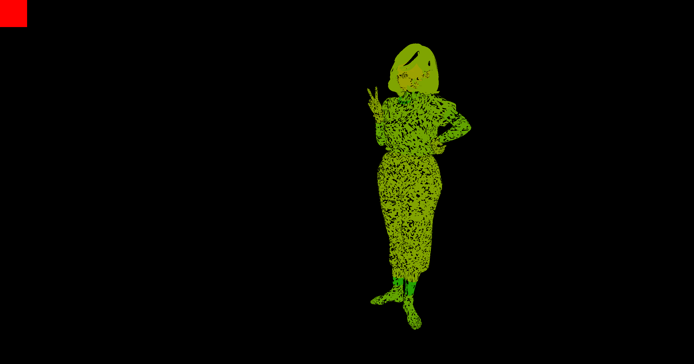
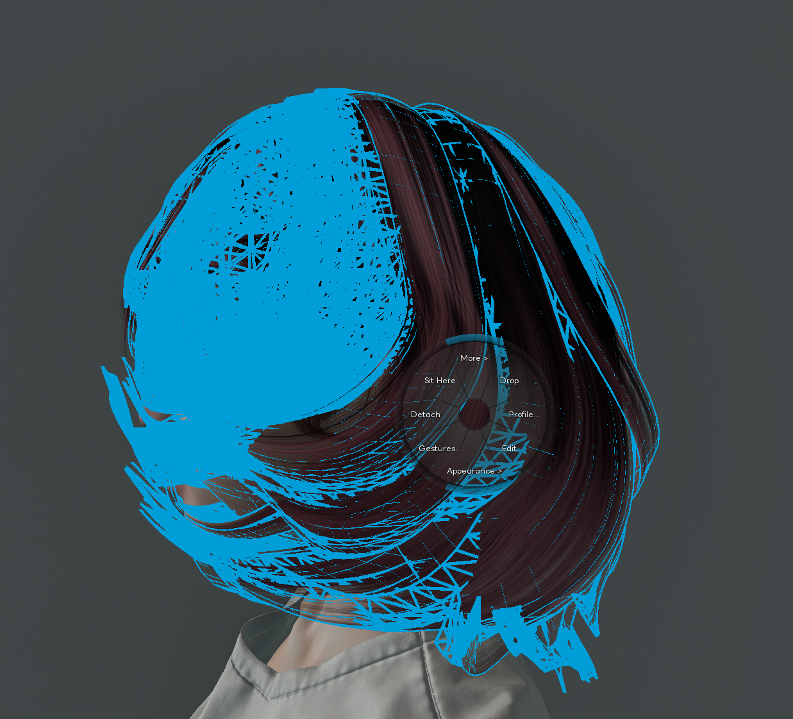
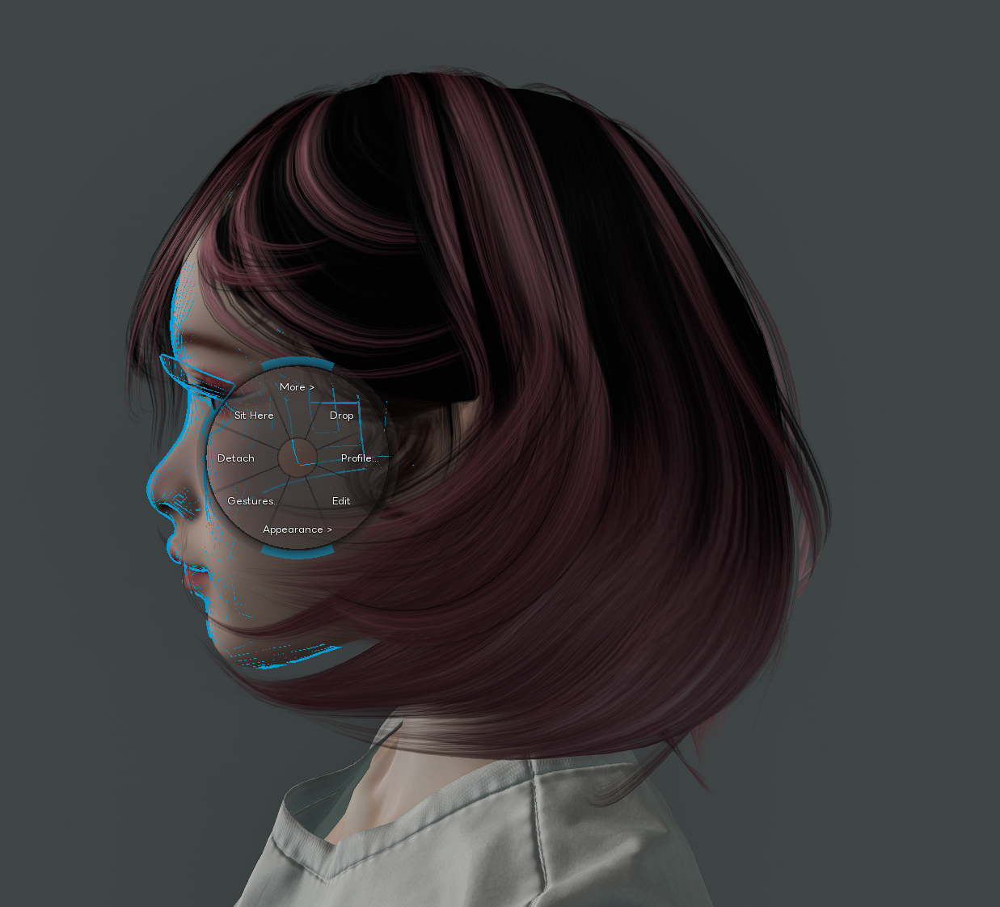

> **Language / 言語 / 语言**: **English** · [日本語](./rigged-mesh-picker-gpu-buffer.ja.md) · [中文](./rigged-mesh-picker-gpu-buffer.zh.md)

# Rigged Mesh Picker — A GPU object-ID buffer fix for a structural bug shared by all SL viewers

**Status**: Implemented in AYAstorm (r21.1 — self pick / r28 — other-avatar pick). Open for free adoption by any LL viewer fork — no PR required, pull what you need.

**Reference commits** on `mayatonton/phoenix-firestorm` (`ayastorm-release` branch):

| commit | author | role |
|---|---|---|
| `940b989ca5` (2026-05-14) | mayatonton (AYA) | r21.1 initial — replace upstream rigged ray-mesh with independent fallback |
| `f3c0829ea8` (2026-05-14) | mayatonton (AYA) | r21.1 M4.17 — per-`LLDrawInfo` `mFSPickerLocalID` resolves BoM hash collision |
| `d4fa807f00` (2026-05-14) | mayatonton (AYA) | r21.1 cleanup — CPU stage removed, GPU path unified (~746-line reduction) |
| `34acea572f` (2026-05-15) | mayatonton (AYA) | r21 M5 — `FSSelfRiggedPickerGPU` default flipped to ON |
| `cd35ef4fd8` (2026-05-15) | **t-noami** | M6 — selection handoff fix, single `handleObjectSelection()` after AYA block |
| `556607465f` (2026-05-15) | **t-noami** | M7 — armed-window mode (GPU pass only during hover) |
| `7aa18dde2e` (2026-05-19) | **t-noami** | r28 — extension to non-self avatars |
| `c97c14a19d` / `3792ecf857` (2026-05-19/21) | **t-noami** | r28 — buffer-owner tracking, stale-frame rejection |
| `8e68f83ba9` (2026-05-20) | mayatonton (AYA) | r28 P0 fixup — cvar consolidation, verification log strip |

**Deep traces**:
- [`docs/specs/ayastorm-r21-self-rigged-picker.md`](./ayastorm-r21-self-rigged-picker.md) (self picker design + canary protocol)
- [`docs/specs/ayastorm-r21-picker-armed-mode.md`](./ayastorm-r21-picker-armed-mode.md) (armed-window perf gate)
- [`docs/specs/ayastorm-r28-other-rigged-picker.md`](./ayastorm-r28-other-rigged-picker.md) (other-avatar extension)
- [`docs/specs/ayastorm-r21-selection-handoff-investigation.md`](./ayastorm-r21-selection-handoff-investigation.md) (M6 handoff fix)

---

## 1. TL;DR

When a user right-clicks a **rigged mesh attachment** (hair, dress, accessories on a Mesh body / Mesh head), every Linden Lab–derived viewer attempts the hit test on the **CPU** against bind-pose vertex data. Three structural failures result:

1. **Skinning drift** — the CPU vertex data is the rest pose; the GPU vertex you actually see has had idle animation skinning applied. Mismatch is typically a few centimetres, enough that at portrait distance the cursor never lands on the visible mesh.
2. **Alpha-discard pierce** — hair / sleeved-fabric triangles that the GPU `discard`s in the fragment shader are still solid to the CPU ray, so clicks "go through" the visible mesh into whatever is behind.
3. **Closeup miss** — at face-portrait zoom the bind-pose error swamps the on-screen distance the user is aiming at.

AYAstorm renders a dedicated **GPU object-ID buffer** at the same resolution as the visible scene, using the **same skinning matrices and the same alpha-discard path**, packs the source object's 32-bit `LocalID` into RGBA8, and resolves the right-click pixel via a single `glReadPixels(1, 1)`. Visible pixel → object identity, pixel-perfect, by construction.

The result is the "**Add to SSS whitelist**" right-click flow that actually grabs the mesh the user can see — across hair, sheer fabric, Bento head parts, and BoM bodies, at any zoom level. The fix is at the rendering-pipeline level rather than a workaround on top of the CPU ray path.

## 2. Affected viewers

This bug is **not AYAstorm-specific**. The CPU ray-mesh intersection lives in Linden Lab's upstream viewer source, so any viewer derived from LL upstream inherits the same code path.

Reproduction is viewer-agnostic. Zoom in on an avatar wearing a Bento head and any common rigged hair, try to right-click directly on a visible strand of hair — the menu that opens is almost always the body underneath, the head, or "nothing".

## 3. Symptom

Concrete user-visible failure modes seen in every CPU-ray viewer:

- **"I can see the hair, I'm clicking on the hair, the menu says I clicked the dress."**
- At face zoom, the right-click menu for a Bento head opens the system avatar bones instead.
- Right-clicking a translucent sheer sleeve picks the body underneath; right-clicking a windowed cap brings up the hair behind it.
- Multi-prim BoM bodies (head + torso + hands as separate Mesh assets sharing one rig) cannot be distinguished — the picker either always returns the same prim or never the one you targeted.

Most viewers paper over this with "select the avatar instead" coarse-grained selection, which is unhelpful when (as in AYAstorm's Skin SSS whitelist flow) the **mesh asset UUID itself** is the desired output.

## 4. Root cause

### 4.1 The upstream path

Upstream `LLPipeline::lineSegmentIntersectInWorld()` walks visible objects and calls `LLViewerObject::lineSegmentIntersect()`, which for a rigged mesh ultimately tests the world-space ray against the **CPU-side vertex buffer**. That buffer holds **bind-pose (rest-pose) positions** — it is never re-skinned per frame, because skinning is exclusively a GPU concern.

```
[ user click ]
      ↓
LLPipeline::lineSegmentIntersectInWorld()
      ↓
LLViewerObject::lineSegmentIntersect()        ← CPU
      ↓
ray test against bind-pose vertex buffer       ← drift source
      ↓
"hit" / "miss" with up to cm-scale error
```

### 4.2 The three structural failures

| failure | cause | when it bites |
|---|---|---|
| **Skinning drift** | CPU bind-pose vs GPU skinned-pose mismatch | Always non-zero; visible at portrait zoom and above |
| **Alpha-discard pierce** | CPU treats every triangle as opaque; GPU `discard`s alpha-cutout fragments | Hair, lace, mesh-tights, sheer fabric, windowed caps |
| **Closeup miss** | Drift error becomes large relative to the on-screen target | Any close-up shot of face / hands / fine accessories |

### 4.3 The identity problem (BoM mesh hash collision)

A separate but compounding issue: when AYAstorm first identified picked rigs by `LLMeshSkinInfo::mHash` (the rig's skinning hash), it ran into BoM bodies where several distinct Mesh assets (head, torso, hands) share **the same rig hash**. The hash-keyed map collapsed all of them to a single identity, so the picker could never disambiguate them.

## 5. The fix

### 5.1 Architecture

```
[ user hovers ]
      ↓
armed window opens (~150ms)
      ↓
per visible frame, while armed:
  bind FBO → ID buffer (WorldViewRectRaw resolution, RGBA8)
  for each rigged DrawInfo on the target avatar:
    bind fsObjectIDV.glsl / fsObjectIDF.glsl
    upload skinning matrix palette  ← same matrices as visible scene
    upload object_id_packed = pack32(LocalID)  ← uniform vec4 in [0,1] bytes
    draw with same VBO, same depth test, same alpha-discard
      ↓
[ user right-clicks ]
      ↓
fsselfriggedpicker.cpp::readObjectIDBufferLocalID(x, y)
  scaled → raw pixel (HiDPI)
  window → buffer-local (WorldViewRect offset)
  glReadPixels(1, 1, RGBA, UNSIGNED_BYTE)
  unpack: id = b0 | b1<<8 | b2<<16 | b3<<24
      ↓
findAttachmentOnAvatarByLocalID(target_avatar, id)  ← scoped by avatar
      ↓
LLViewerObject* → menu, SSS.Add, …
```

### 5.2 Encoding (pipeline.cpp:10796–10800)

```cpp
F32 r = ((id >>  0) & 0xff) / 255.f;
F32 g = ((id >>  8) & 0xff) / 255.f;
F32 b = ((id >> 16) & 0xff) / 255.f;
F32 a = ((id >> 24) & 0xff) / 255.f;
gFSObjectIDShader.uniform4f(sObjectIDPacked, r, g, b, a);
```

The U32 LocalID is split into four bytes on the CPU and uploaded as a `vec4` uniform. The fragment shader writes that vec4 directly. RGBA8 with no filtering preserves the bytes losslessly; `glReadPixels` returns them in the same order.

### 5.3 Per-DrawInfo identity (llvovolume.cpp:5840–5843, 5783)

To resolve the BoM hash collision, `LLDrawInfo` carries a per-prim `mFSPickerLocalID`, stamped from `LLViewerObject::getLocalID()` at DrawInfo construction. Batch merge logic is extended to require `mFSPickerLocalID` equality, so two different Mesh assets that happen to share a skinning hash do **not** merge into one batch.

### 5.4 Same-as-visible guarantee

The ID-buffer pass uses:

- the same `getObjectSkinnedTransform()` GLSL helper as the visible scene's rigged shaders,
- the same skinning matrix palette uploaded via `LLRenderPass::uploadMatrixPalette()`,
- the same VBOs, the same depth test, the same alpha-discard branch.

Whatever you see on screen, that exact pixel is what the ID buffer records. There is no second source of truth.

### 5.5 Mouse coordinate conversion (fsselfriggedpicker.cpp:80–116)

Two corrections are mandatory and both are easy to forget:

1. **HiDPI**: convert logical (LLCoordGL) → raw pixel using `DisplayScale = WindowWidthRaw / WindowWidthScaled`.
2. **UI chrome offset**: the ID buffer covers `WorldViewRectRaw`, not the window — subtract `mLeft` / `mBottom`.

Forgetting either returns `id == 0` (the cleared background colour) and the picker silently falls back to upstream worldray, which then fails for all the reasons in §4. Most "GPU picker doesn't work" reports during development traced back to one of these two.

## 6. Why this works

The structural failures of §4 disappear because the ID buffer is rendered with the same skinning, same depth, and same alpha-discard as the visible scene.

| failure (§4) | how the ID buffer fixes it |
|---|---|
| Skinning drift | shader re-runs `getObjectSkinnedTransform()` per frame with the visible-scene matrix palette → the ID pixel and the colour pixel coincide |
| Alpha-discard pierce | fragment `discard` runs identically in the ID shader → discarded fragments never appear in the ID buffer; the user clicks "through" alpha holes onto whatever is behind, exactly matching what they see |
| Closeup miss | pixel resolution = visible pixel resolution; one pixel is one pixel of accuracy |

The picker no longer has any geometric independence from the renderer — that's the whole point.

## 7. Performance

Naïve "always render the ID buffer" would cost ~130 rigged draw calls per frame just for the picker. The **armed window** (`FSSelfRiggedPickerArmedMode`, default ON; `FSSelfRiggedPickerArmSeconds`, default short) restricts the pass to **frames where the cursor is over an avatar**:

- Outside the armed window: zero extra draw calls. Picker is dormant.
- Inside the armed window (hover only): one ID-buffer pass per frame for the scoped avatar. Same draw count as one regular rigged pass.

The r28 other-avatar extension adds a buffer-owner field so that buffers built for avatar A are not consumed for clicks on avatar B; stale frames are rejected rather than mis-resolved.

## 8. Verification

The most legible proof is to dump the ID buffer to disk. Each mesh on the avatar ends up in a unique colour (the packed `LocalID`); the cleared background is solid black.



The picker buffer we generate.

To reproduce:

1. Use a Bento head, a Mesh body, a rigged hair, and a rigged dress.
2. Zoom to portrait distance.
3. Right-click directly on a visible strand of hair → **Add to SSS whitelist** (or any rigged-aware right-click action).

   - **GPU pixel-accurate picker (AYAstorm)**: the hair is selected; its mesh asset UUID is added.
   - **CPU ray-mesh-intersection picker (LL upstream-derived)**: the menu opens for the body, the head, or "no object".

4. Sheer-fabric test: right-click an alpha-cutout hole in a windowed cap or lace top.

   - **GPU pixel-accurate picker**: the object behind is picked (because the ID buffer is `discard`ed in the hole).
   - **CPU ray-mesh-intersection picker**: the cap / top is picked even though you can see through it.

## 9. What only this approach can do — picking the face through hair gaps

| Aim at the hair | **Aim at the head through the hair** |
|:---:|:---:|
|  |  |
| Click directly on a strand → the hair mesh is selected (blue wireframe = hair). | **Click on the face visible between the hair strands → the click pierces the hair and the head mesh is selected** (blue wireframe = head). In a ray-mesh-intersection picker, the click stops at the front triangle of the hair, so reaching the head behind it has traditionally required detaching the hair first. |

Because the picker buffer is rendered with the **exact same alpha-discard** as the visible scene, a side-effect falls out for free: **transparent meshes are also transparent to the picker**.

- The side of a face visible between hair strands → the click picks the face.
- Skin visible through lace or sheer fabric → the click picks the skin.
- An ear visible through a hoop earring or finger ring → the click picks the ear.

**Behaviour difference vs. a ray-mesh-intersection picker** (behind a transparent mesh):

| picker approach | what happens behind a transparent mesh |
|---|---|
| ray-mesh intersection | the ray hits the front mesh's **triangle** and stops. The **texture alpha** at the intersection point is not available to the picker — the face visible between the hair strands is visible on screen but unreachable through the picker. |
| GPU pixel-accurate (this implementation) | the picker buffer itself is rendered with alpha-discard, so it is **punched through** wherever the visible scene is. Whatever pixel shows the face on screen is the face in the picker too, and the click reaches it directly. |

A ray-mesh-intersection picker can only answer "did the ray hit a triangle on this mesh?". It cannot consult the **texture alpha** at the intersection point. A BoM body's skin mesh is laid out as one continuous triangle sheet from ear to shoulder to waist, so wherever hair or clothing share the same visible footprint, no path exists to *reach* what is behind.

This resolution is a byproduct of rendering **one buffer with the exact same shader as the visible scene** — an option that only opens up once you commit to the GPU pixel-accurate approach.

## 10. What this fix does NOT solve

- **Non-rigged attachments** (rigid prim accessories, single-prim earrings) continue to use the upstream `lineSegmentIntersectInWorld` path. They never had the rigged drift / discard problem and re-implementing them on the GPU would be churn. If the GPU buffer returns `id == 0` for a click, the picker explicitly **falls back** to upstream worldray.
- **HUD attachments** are out of scope. HUDs are rendered into their own RT and have their own pick path.
- **Coarse `LLToolPie` selection on terrain / water / static prims** is untouched.

## 11. Adoption

The minimal set to import:

| file | role |
|---|---|
| `indra/newview/fsselfriggedpicker.{h,cpp}` | mouse-coordinate conversion, `glReadPixels`, scoped avatar walk |
| `indra/newview/pipeline.cpp` — `renderRiggedObjectIDBufferForAvatar()`, `renderSelfRiggedObjectIDBuffer()`, `renderOtherRiggedObjectIDBuffer()` | per-frame ID-buffer pass + armed-window gate |
| `indra/newview/llvovolume.cpp` — `mFSPickerLocalID` stamp on DrawInfo + merge guard | per-prim identity for BoM bodies |
| `indra/newview/app_settings/shaders/class1/deferred/fsObjectIDV.glsl` | rigged vertex shader (re-uses `getObjectSkinnedTransform()`) |
| `indra/newview/app_settings/shaders/class1/deferred/fsObjectIDF.glsl` | fragment shader (single-line `frag_color = object_id_packed`) |
| `indra/newview/lltoolpie.cpp` — handler chain into the picker | right-click resolution |
| `indra/newview/llviewercontrol.cpp` + `settings.xml` | `FSSelfRiggedPickerGPU` / `FSSelfRiggedPickerArmedMode` / `FSSelfRiggedPickerArmSeconds` |

```sh
git remote add ayastorm https://github.com/mayatonton/phoenix-firestorm.git
git fetch ayastorm ayastorm-release

# cherry-pick range that covers the GPU path + cleanup + identity fix
git log --oneline 940b989ca5^..8e68f83ba9 -- indra/newview/fsselfriggedpicker.cpp indra/newview/pipeline.cpp indra/newview/llvovolume.cpp indra/newview/app_settings/shaders/class1/deferred/fsObjectID*.glsl
```

No PR is planned upstream — take it on your own terms.

## 12. Attribution

- **mayatonton (AYA)**: initial self-picker design, GPU-replacement architecture, CPU-stage removal, BoM identity fix (M4.17), default-on flip, r28 P0 cleanup.
- **t-noami**: M6 selection handoff fix, M7 armed-mode performance gate, r28 extension to other avatars, buffer-owner tracking.

---

## License

This document and the reference implementation in `ayastorm-release` are released under the same license as Phoenix-Firestorm / Linden Lab viewer (LGPL v2.1).
