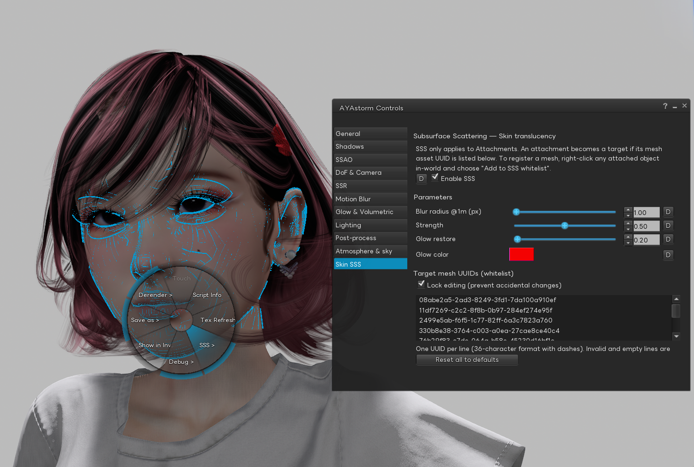
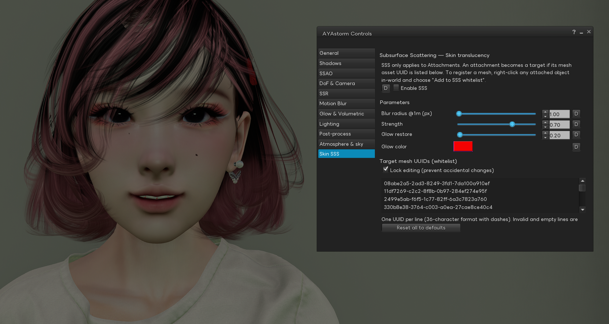
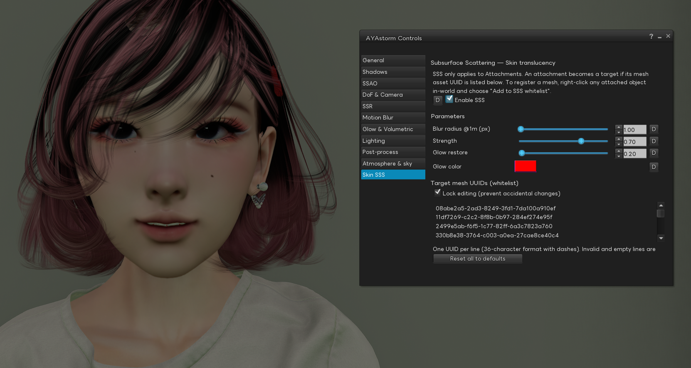

> **Language / 言語 / 语言**: [English](./skin-sss-user-guide.md) · [日本語](./skin-sss-user-guide.ja.md) · **中文**

# Skin SSS (次表面散射) — 使用指南

**适用版本**: AYAstorm r20 及以后。r30 起 UI 已迁移至 **AYAstorm Controls**。

**位置**: 顶部菜单 → **AYAstorm → AYAstorm Controls...** (快捷键 `Alt+C`) → **Skin SSS** 标签页。

### 应用对比 (同一场景、同一光照、同一镜头)

| Skin SSS **关闭** | Skin SSS **开启** |
|:---:|:---:|
|  |  |
| 皮肤高光锐利,脸颊到阴影的过渡呈现明显边缘。 | 高光柔化,脸颊到阴影的过渡变得平滑,脸颊与鼻翼周围带有淡淡的暖色感。 |

---

## 1. Skin SSS 是什么

真实皮肤并不是硬表面 — 光会稍微进入皮肤内部、产生散射,再带着柔化和淡淡色调返回出来 (这正是逆光时耳朵会发红、人像照片在脸颊和鼻翼周围带有"温暖柔和感"的原因)。在 SL 中,许多 Skin 品牌多年来一直凭借细致的绘制和质感表现攻克这一课题,如今 SL 里能看到的肌肤表达已经做到非常出色的水准。**Skin SSS** 的初衷,是希望在**渲染端再为这些 Skin 作品做一层支撑** — 在原有的画力之下再垫一层。

仅在角色 **皮肤区域** 应用屏幕空间次表面散射近似,不影响衣物、头发、配饰。可见效果:

- 脸颊、耳朵、鼻子的明暗过渡更柔和,略带暖色
- 皮肤上的硬高光峰被温和软化,变成柔和的暖色光晕,读起来更像光在皮肤上散开、而不是从硬表面反射
- 可选的红色偏移"glow"会补回模糊抹掉的小高光峰,呈现更健康、有血色的肤色

效果在动态中刻意保持低调、在静止画面中清晰可辨 — 专为人像 / 电影感摄影而设计。

## 2. 前置条件

| 需求 | 说明 |
|---|---|
| View Mode | **AYAstorm View** (偏好设置 → 图形)。Firestorm View 不执行 SSS pass。 |
| Deferred Rendering | 必需 (AYAstorm View 始终开启)。 |
| Mesh body / head | Mesh 资产 UUID 已注册到白名单 (§4)。**出厂时白名单为空**,需要先把你穿戴的 Mesh body / head 注册进去,SSS 才能识别它们。 |

## 3. 控件说明

所有控件位于 AYAstorm Controls 的 **Skin SSS** 标签页。每行右侧的 **D** 按钮可单独将该值恢复为 AYAstorm 默认值。

| 控件 | 作用 | 默认值 |
|---|---|---|
| **Enabled SSS** | SSS pass 的总开关。关闭后回到 SL 标准皮肤光照。 | 开 |
| **Blur radius** | 光在皮肤内部的扩散距离 (以 1 m 视距为基准)。shader 会按距离自动缩小,即使镜头距离改变也能保持外观一致。 | 1.0 |
| **Strength** | 原始光照像素与 SSS 模糊像素的混合比。0.0 = 看不到 SSS / 1.0 = 完全 SSS。人像通常在 0.4 – 0.6 之间最自然。 | 0.5 |
| **Glow gain** | 模糊之后再补回的红色偏移高光强度。补偿强模糊导致高光"发闷"的副作用。0.0 = 纯 SSS / 越高血色感越强。 | 0.2 |
| **Glow color** | 补光的色调。默认纯红 (1, 0, 0) 读作健康血色感。偏橙色 = 暖肤,偏品红 = 冷 / 白皙肤色。 | 纯红 |
| **Reset all to defaults** | 一键把以上 5 个值 **以及** 白名单 (§4) 全部重置为 AYAstorm 默认。 | — |

推荐调整顺序: **Blur radius** 保持 1.0,先用 **Strength** 找到脸颊和鼻子的柔和度,再轻推 **Glow gain** 把高光峰找回来。

## 4. 白名单 — 告诉 viewer 哪个 Mesh 是"皮肤"

SL 没有"这个 mesh 是皮肤还是衣物?"的查询 API — 在 renderer 眼里 Mesh body / head / hands 都长得一样。为了避免把眼睛、牙齿、指甲、饰品也模糊掉,Skin SSS 只在 **明确注册的 Mesh 资产 UUID** 上执行。

### 注册一个 Mesh

1. **穿戴** 你想应用 SSS 的 Mesh body / Mesh head。
2. 在场景中 **右键** 自己角色上的附件 → **Add to SSS whitelist**。
   - 多部件 body (头 + 身 + 手) 可以用同一菜单里的 **Add entire linkset to SSS whitelist** 一次性注册整套 linkset。
3. 该 Mesh 的资产 UUID 会被追加到 **Skin SSS** 标签页的白名单文本区。

**出厂时白名单为空。** 启用 SSS 之后,需要按上述步骤注册你实际穿戴的 Mesh body / head,效果才会出现。

### 手动编辑白名单

白名单是纯 UUID 文本 — 每行一个 36 字符 dash 分隔的 UUID。为防误操作,文本区初始为 **锁定** (只读):

- 取消勾选 **Lock editing (prevent accidental changes)** 即可编辑。
- 从笔记卡或其他来源复制 UUID,一行一个粘贴。
- 编辑完后重新锁上,列表会自动保存。

### 移除一个 Mesh

右键附件 → **Remove from SSS whitelist** (多部件一次性移除用 **Remove entire linkset…**)。

## 5. 快速上手

1. AYAstorm → AYAstorm Controls (`Alt+C`)。
2. 打开 **Skin SSS** 标签页。
3. 确认 View Mode 为 **AYAstorm View** (否则在偏好设置 → 图形 切换)。
4. 勾选 **Enabled SSS**。
5. 看自己角色的脸。如果高光仍然很硬、没有变化,说明该 Mesh head 还没注册到白名单 — 右键头部 → **Add to SSS whitelist**。
6. 想要更柔和的外观,把 **Strength** 调到 0.7。如果血色感显得有些淡,把 **Glow gain** 上调到 0.3 左右。

## 6. 小技巧

- **人像**: **Strength** 稍高 (0.6 – 0.7),**Glow gain** 在 0.2 – 0.3。皮肤会柔和但不平淡。
- **全身或带场景**: 默认 0.5 / 0.2 通常合适。距离一拉远 blur radius 自动缩小,不会过量。
- **眼睛 / 牙齿被模糊**: 那个 Mesh 的 UUID 被错误地注册为皮肤了。右键对应附件 → **Remove from SSS whitelist**。
- **切换 Enabled 没变化**: 检查 View Mode 是否为 AYAstorm View,以及附件 Mesh **至少一个** UUID 在白名单中。
- **性能**: SSS 是单次屏幕空间 pass,开销与 SSAO 相当,不会成为帧时间的主要消耗。

## 7. 恢复默认

- **单项**: 点该行的 **D** 按钮。
- **本标签页全部 (含白名单)**: 点 **Reset all to defaults**。

白名单默认值是 **空列表**,重置会清掉你注册过的所有 Mesh body / head,需要按 §4 重新注册一遍 — 请知情后使用。

## 8. 故障排查

| 症状 | 原因 | 解决 |
|---|---|---|
| SSS 开/关看不出差别 | View Mode 是 Firestorm View | 偏好设置 → 图形 切换到 AYAstorm View |
| 脸已经柔和但手脚的高光仍然很硬 | 手脚是独立 Mesh 资产、未注册 | 右键对应部件 → Add to SSS whitelist |
| 眼睛 / 牙齿 / 指甲发糊 | 它们与 body 共用 Mesh UUID,或被误加进白名单 | 右键 → Remove from SSS whitelist (或在文本区删除对应 UUID) |
| 白名单文本区无法编辑 | 锁是开的 (默认安全状态) | 取消勾选 **Lock editing** |
| 效果太强 / 太弱 | **Strength** 数值不合适 | 自然范围 0.4 – 0.6 |

## 9. 进一步阅读

- SSS shader 与白名单机制的工程规范: [`docs/specs/ayastorm-r20-avatar-skin-sss.md`](./ayastorm-r20-avatar-skin-sss.md)
- UI 位置变更 (r30): [`docs/specs/ayastorm-r30-aya-controls-tab-overhaul.md`](./ayastorm-r30-aya-controls-tab-overhaul.md)
